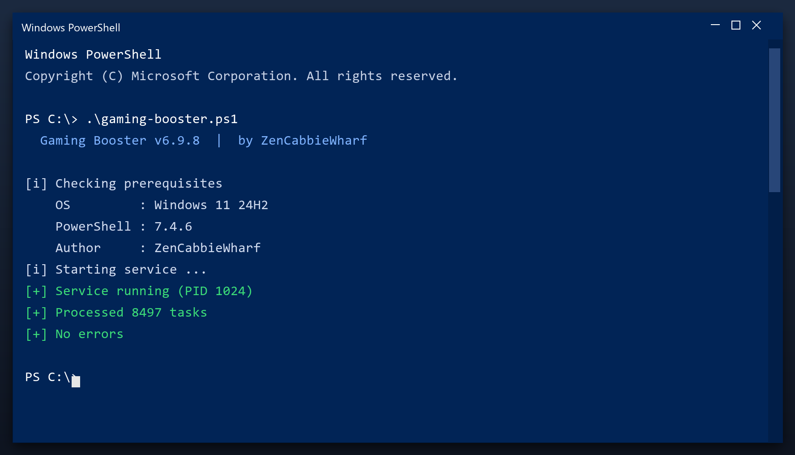

# Download Gaming Booster for Free — Latest 2026 Version

  

**At a glance**

| | |
| --- | --- |
| **Program** | Gaming Booster |
| **Version** | Latest 2026 build |
| **Price** | Free |
| **Systems** | see requirements below |
| **Download** | Quick Start section below |

---

**Gaming booster** is a maintenance tool for Windows written to be simple: one window, plain settings, no confusing options. Download it, run a scan, done. **Free to use, no strings attached.**

  

## 1. Overview

Gaming booster is a small Windows tool for routine maintenance. You do not need to understand the technical details - it reports what it found in plain language and only changes things after you agree. Nothing runs in the background and nothing phones home.

| **Term** | **Meaning** |
| --- | --- |
| **Plain language** | No technical jargon |
| **Report** | A summary of what was found |
| **Confirm** | You approve before changes |
| **No telemetry** | Nothing is sent anywhere |

## 2. Technical Details

| **Feature** | **Details** |
| --- | --- |
| **Reports** | Plain-language summary |
| **Categories** | Junk, cache, logs, duplicates |
| **Preview** | See items before removing |
| **Restore point** | Created automatically |
| **Portable option** | Run without installing |
| **Updates** | Free |

## 3. System Requirements

| **Component** | **Details** |
| --- | --- |
| **OS** | Windows 10, 11 |
| **Architecture** | 64-bit |
| **RAM** | 2 GB minimum |
| **Disk space** | 100 MB |
| **Admin rights** | Yes, for cleanup tasks |
| **Internet** | Only to download |

## 4. Installation

1. **Download** the file below
2. **Run** the installer and follow the steps
3. **Open** the tool and press Scan
4. **Review** what it found
5. **Apply** the fixes - a restore point is created first

  

> **Note:** if nothing happens when you click, run the file as administrator. Windows sometimes blocks new programs until you allow them.

## 5. What's Included

| **Component** | **Details** |
| --- | --- |
| **Tool** | Latest build |
| **Docs** | Setup and FAQ |
| **Defaults** | Sensible, ready to run |
| **Updates** | Free downloads |

## 6. Comparison

| **Feature** | **Windows built-in** | **gaming booster** |
| --- | --- | --- |
| **Depth** | Basic | Detailed |
| **Categories** | One | Many |
| **Report** | Minimal | Plain-language |
| **Scheduling** | Limited | Built in |

## 7. Common Issues

| **Issue** | **Fix** |
| --- | --- |
| **Windows warns about the file** | Click More info, then Run anyway |
| **Slow first launch** | Normal - it indexes on first run |
| **Scan finds nothing** | Good - your PC is already clean |
| **Settings do not save** | Run as admin once so it can write config |

## 8. Maintenance Tips

- Do not run two cleaners at the same time
- Use the preview to see what will be removed
- Keep the restore point until you are sure
- Re-scan after installing big programs
- Back up documents before any deep clean

## 9. Frequently Asked Questions

**Will it speed up my games?**

It can help by freeing RAM and stopping background tasks, but it is not a game booster.

**Does it delete my downloads?**

No. It only removes temporary and leftover data, never your own files.

**Can I schedule it?**

Yes, you can set it to run weekly automatically.

**What if I do not like it?**

Uninstall it normally from Windows Settings - it leaves nothing behind.

---

*sparkling-valley-504 · Updated 2026-10-09 · Shared under the MIT License*
